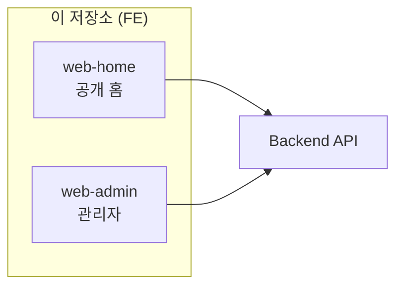

<div align="center">

# Number-One-Daeri **FE**

### 일등대리 · 프론트엔드 모노레포

**공개 홈페이지**와 **관리자 웹**을 한 저장소에서 나란히 다룹니다.

<br />

[](https://nodejs.org/)
[](https://pnpm.io/)
[](https://nextjs.org/)
[](https://react.dev/)
[](https://www.typescriptlang.org/)
[](https://tailwindcss.com/)

<br />

[Web apps](#web-apps) · [Layout](#layout) · [Stack](#stack) · [Scripts](#scripts)

</div>

<br />

---

## Web apps

운영·대외 채널이 **코드베이스에서부터 분리**되어 있습니다. 배포 URL·인증·UI 톤도 앱마다 다르게 가져가기 좋은 형태입니다.

| 구분 | **web-home** · 일반(대외) 홈 | **web-admin** · 관리자 웹 |
|------|-------------------------------|---------------------------|
| **경로** | `apps/web-home` | `apps/web-admin` |
| **역할** | 랜딩, 공지, 문의, 약관·개인정보 등 **고객이 보는 사이트** | 운행·고객·정산·공지·1:1 문의 등 **내부 운영·백오피스** |
| **기본 포트** | `3000` | `3002` |
| **스택** | Next.js App Router, Tailwind 4 | 동일 계열 |

두 앱 모두 **동일 백엔드 API**에 붙도록 설계되어 있습니다. API 서버 코드는 **이 레포 밖(별도 백엔드 레포)** 에서 관리합니다.



---

## Layout

```
ride-fe/
├── apps/
│   ├── web-home/          # 공개 홈페이지 (Next.js)
│   ├── web-admin/         # 관리자 페이지 (Next.js)
│   ├── mobile-user/       # Flutter 사용자 앱 — 플레이스홀더
│   └── mobile-driver/     # Flutter 기사 앱 — 플레이스홀더
├── packages/
│   └── shared/            # 공통 TypeScript 타입 등
└── docs/                  # 내부 메모·카피 정리 등 (선택)
```

| 경로 | 설명 |
|------|------|
| `apps/web-home` · `apps/web-admin` | 라우팅·컴포넌트·API 클라이언트가 **완전 분리**. 도메인·환경변수·배포 파이프라인도 **앱 단위**로 잡을 수 있음. |
| `packages/shared` | 도메인 모델·공용 타입을 한곳에 두고 웹 앱에서 import. |
| `apps/mobile-*` | 모노레포 안에는 자리만 두고, 실제 Flutter 작업은 보통 **별도 작업 트리**에서 진행하는 전제. |

---

## Stack

| 구분 | 내용 |
|------|------|
| **런타임** | Node.js **20+** |
| **패키지 매니저** | **pnpm** 워크스페이스 (`pnpm >= 10`) |
| **웹** | **Next.js 15** · **React 19** · **Tailwind CSS 4** |
| **품질** | ESLint (`pnpm -r lint`) |

---

## Scripts

루트 `package.json`에서 자주 쓰는 명령입니다.

| 명령 | 설명 |
|------|------|
| `pnpm install` | 워크스페이스 전체 의존성 설치 |
| `pnpm dev` | **web-home + web-admin** 동시에 개발 서버 |
| `pnpm dev:home` | 공개 홈만 |
| `pnpm dev:admin` | 관리자만 |
| `pnpm build` | 모든 패키지 빌드 (`pnpm -r build`) |
| `pnpm lint` | 모든 패키지 린트 |

환경변수·API 베이스 URL 등은 앱마다 다르므로, 각각 **`apps/web-home/.env.example`**, **`apps/web-admin/.env.example`** 를 기준으로 맞추면 됩니다.

---

<div align="center">

<sub>일등대리 프론트엔드 · <code>Number-One-Daeri-fe</code></sub>

</div>
