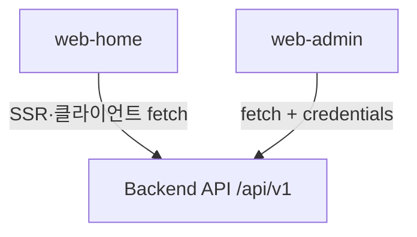

<div align="center">

[**Number-One-Daeri-fe**](https://github.com/oh1marin/Number-One-Daeri-fe) · [**Number-One-Daeri-be**](https://github.com/oh1marin/Number-One-Daeri-be) · [**Number-One-Daeri-user-app**](https://github.com/oh1marin/Number-One-Daeri-user-app)

<br />

# Number-One-Daeri **FE**

### 일등대리 · 프론트엔드 모노레포

**공개 홈페이지**와 **관리자 웹**을 한 저장소에서 나란히 다룹니다.

[**대외 홈 (운영)**](https://www.xn--vk1bv0b35gbnr.kr/) · [**관리자 (운영)**](https://www.xn--zb0bu7iuubp7hba523s.kr/)

<br />

[](https://nodejs.org/)
[](https://pnpm.io/)
[](https://nextjs.org/)
[](https://react.dev/)
[](https://www.typescriptlang.org/)
[](https://tailwindcss.com/)

<br />

[Sites](#sites) · [Highlights](#highlights) · [API](#api-integration) · [Repos](#repos) · [Web apps](#web-apps) · [Layout](#layout) · [Stack](#stack) · [Scripts](#scripts)

</div>

<br />

---

## Repos

같은 계정([**oh1marin**](https://github.com/oh1marin))에서 함께 운영하는 레포입니다. 로컬에서는 보통 **형제 폴더**로 클론해 둡니다.

| | GitHub | 로컬 경로 예시 |
|---|--------|----------------|
| **FE** (이 저장소) | [oh1marin/Number-One-Daeri-fe](https://github.com/oh1marin/Number-One-Daeri-fe) | `Number-One-Daeri-fe/` |
| **BE** (백엔드 API) | [oh1marin/Number-One-Daeri-be](https://github.com/oh1marin/Number-One-Daeri-be) | `Number-One-Daeri-be/` |
| **사용자 앱** (Flutter) | [oh1marin/Number-One-Daeri-user-app](https://github.com/oh1marin/Number-One-Daeri-user-app) | `Number-One-Daeri-user-app/` |

```text
원하는 부모 디렉터리/
├── Number-One-Daeri-fe/          ← 이 레포 (Next.js web-home · web-admin)
├── Number-One-Daeri-be/          ← API 서버
└── Number-One-Daeri-user-app/    ← 사용자 앱 (Flutter)
```

---

## Sites

| 구분 | 운영 URL |
|------|----------|
| **대외 홈** (`web-home`) | [https://www.xn--vk1bv0b35gbnr.kr/](https://www.xn--vk1bv0b35gbnr.kr/) |
| **관리자** (`web-admin`) | [https://www.xn--zb0bu7iuubp7hba523s.kr/](https://www.xn--zb0bu7iuubp7hba523s.kr/) |

브라우저 주소창에 보이는 **Punycode**(`xn--…`) 도메인이며, 일등대리 운영 DNS와 동일한 호스트입니다.

---

## Web apps

운영·대외 채널이 **코드베이스에서부터 분리**되어 있습니다. 배포 URL·인증·UI 톤도 앱마다 다르게 가져가기 좋은 형태입니다.

| 구분 | **web-home** · 일반(대외) 홈 | **web-admin** · 관리자 웹 |
|------|-------------------------------|---------------------------|
| **경로** | `apps/web-home` | `apps/web-admin` |
| **역할** | 랜딩, 공지, 문의, 약관·개인정보 등 **고객이 보는 사이트** | 운행·고객·정산·공지·1:1 문의 등 **내부 운영·백오피스** |
| **기본 포트** | `3000` | `3002` |
| **스택** | Next.js App Router, Tailwind 4 | 동일 계열 |

두 앱 모두 **동일 백엔드 API**에 붙도록 설계되어 있습니다. API 서버 코드는 **이 레포 밖(별도 백엔드 레포)** 에서 관리합니다.

---

## Highlights

### `web-home` — 대외 홈

- **랜딩·정적**: 서비스 소개, 회사소개, 커뮤니티(공지 목록·상세), 오시는 길(카카오맵), 이용약관·개인정보 등
- **공지 API** (`apps/web-home/lib/notices.ts`): `GET {베이스}/notices?…`, `{베이스}/public/notices?…` 등 **여러 URL을 순차 시도**(백엔드 배치에 따라 하나가 성공). 베이스는 `getBackendBaseForServer()` / `getApiV1Base()` (`apps/web-home/lib/apiBase.ts`) — `RIDE_API_BASE_URL`, `API_SERVER_BASE_URL`, `NEXT_PUBLIC_API_BASE_URL`
- **상담 문의** (`/contact`): 브라우저에서 `POST {apiV1}/contact` JSON (`name`·`email`·`phone`·`content`)

### `web-admin` — 운영 관리

- **인증**: `POST /admin/auth/login` · `register` · `logout` · `refresh`, `GET /admin/auth/me` (`apps/web-admin/lib/AuthContext.tsx`). 세션 쿠키 + `credentials: "include"`가 기본, 일부 화면은 `Authorization: Bearer` 병행
- **1:1 문의**: `GET /admin/inquiries`, `GET /admin/inquiries/:id`, `POST /admin/inquiries/:id/messages` (`lib/inquiriesAdminApi.ts`, `/inquiries`, `/inquiries/[id]`, `ChatWidget.tsx`). 목록 폴링·토스트 알림 등으로 운영자가 유저와 **같은 스레드**에서 주고받음 (앱 쪽 엔드포인트는 **BE·Flutter 레포**에서 확인)
- **마일리지**: `GET /admin/users` + `POST /admin/mileage/adjust` (`/mileage/manage`), `GET /admin/mileage/history`, `GET /admin/mileage/errors`, 엑셀 경로에서 `POST /admin/mileage/bulk-adjust` (`/rides/bulk-import`)
- **그 외 API 연동 화면**: 아래 [API integration](#api-integration) 표에 **이 레포 소스에서 실제 호출하는 경로**를 전부 정리함 (`grep` 기준 `apps/web-admin` 내 `/admin/` 호출)
- **로컬 전용 UI** (`@/lib/store` 등 **백엔드 미연동**): 운행일보 `/daily`, 콜 조회·입력·상세 `/rides`, `/rides/new`, `/rides/[id]`, 기사 `/drivers`, 근태 `/attendance`, 세금계산서 `/invoices`, 통계 `/statistics`, 요금 설정 `/settings` — 브라우저 **localStorage** 기반 데모·레거시 시트 성격

---

## API integration

백엔드는 보통 **`/api/v1`** 아래에 REST JSON API를 두고, 두 Next 앱이 **같은 API 오리진**을 바라보도록 환경변수를 맞춥니다.

| 항목 | 내용 |
|------|------|
| **베이스 URL** | `NEXT_PUBLIC_API_BASE_URL` — 값은 **`https://…/api/v1`** 형태(끝에 `/api/v1` 포함)를 권장. 각 앱 `.env.example` 참고. |
| **web-home (서버)** | RSC/SSR에서 공지 등: `RIDE_API_BASE_URL` 또는 `API_SERVER_BASE_URL` → 절대 URL로 백엔드 호출. 미설정 시 일부 기능은 샘플/비활성. |
| **web-home (브라우저)** | `getApiV1Base()` 기준 `POST …/contact` 등. |
| **web-admin** | `adminFetch` / 각 페이지 `fetch`: `credentials: "include"` + 선택 `Bearer`. |
| **CORS·쿠키** | 백엔드에서 관리자·대외 웹 **Origin**을 허용하고, 관리자 로그인은 **크로스 사이트 쿠키 + credentials** 정책에 맞게 설정되어야 함. |

### `web-home` — 호출 경로 (소스 기준)

| 기능 | 호출 |
|------|------|
| 공지 목록 (`fetchNotices`) | 순차 시도: `GET {apiV1}/notices?limit=50`, `GET {origin}/notices?limit=50`, `GET {apiV1}/public/notices?limit=50` (`lib/notices.ts` — `apiV1`·`origin`은 `apiBase.ts`에서 계산) |
| 상담 문의 (`/contact`) | `POST {apiV1}/contact` JSON |

### `web-admin` — 화면별 호출 경로 (소스 기준)

아래 **`/admin/…` 경로는 모두 `{NEXT_PUBLIC_API_BASE_URL}` 접두 위에 붙습니다** (예: `https://api…/api/v1/admin/dashboard`). 표는 `apps/web-admin`에서 문자열로 검색해 정리했습니다.

| Next 경로 | 호출하는 관리자 API (method + path) |
|-----------|-------------------------------------|
| `/` | `GET /admin/dashboard`, `GET /admin/card-payments/today` |
| `/login`, `/signup` | `POST /admin/auth/login`, `POST /admin/auth/register`, `GET /admin/auth/me`, `POST /admin/auth/refresh`, `POST /admin/auth/logout` |
| `/admin/me` | `GET /admin/me`, `PATCH /admin/me` |
| `/card-payments` | `GET /admin/card-payments/today`, `GET /admin/card-payments` (페이지네이션 쿼리) |
| `/order-status` | `GET /admin/rides` (쿼리스트링 필터) |
| `/order-stats` | `GET /admin/order-stats` |
| `/rides/bulk-import` | `POST /admin/rides/bulk-import`, `POST /admin/mileage/bulk-adjust` |
| `/customers`, `/customers/ledger` | `GET /admin/users`, `GET /admin/customers`, `GET /admin/customers/:id`, `GET /admin/customers/:id/rides` (`lib/customersApi.ts`) |
| `/mileage/manage` | `GET /admin/users`, `POST /admin/mileage/adjust` |
| `/mileage/history` | `GET /admin/mileage/history` |
| `/mileage/errors` | `GET /admin/mileage/errors` |
| `/accumulation` | `GET`·`PUT /admin/accumulation` **또는** `GET`·`PUT /admin/settings/accumulation` (존재하는 쪽을 순차 시도) |
| `/app-access` | `GET /admin/app-access` |
| `/app-install` | `GET /admin/app-install`, `POST /admin/mileage/adjust`, `PATCH /admin/users/:id`, `POST /admin/coupons/send`, `DELETE /admin/app-install/referrer`, `PATCH /admin/users/bulk` (추천인·전화 일괄), `POST /admin/sms/send` |
| `/app-install-stats` | `GET /admin/app-install-stats` |
| `/app-images` | `GET /admin/app-images` |
| `/usage-guide` | `GET /admin/usage-guide`, `PUT /admin/usage-guide` |
| `/coupon-purchases` | `GET /admin/coupons/budget`, `GET /admin/coupons/budget/history`, `…/histories`, `…/logs`, `GET /admin/coupons/purchases`, `GET /admin/coupons/history`, `POST /admin/coupons/budget/charge` |
| `/coupon-requests` | `GET /admin/coupon-requests`, `POST /admin/coupon-requests/:id/complete` |
| `/promo-list` | `GET /admin/coupons`, `POST /admin/coupons/send` |
| `/recommendation-kings` | `GET /admin/recommendation-kings` |
| `/withdrawals` | `GET /admin/withdrawals`, `POST /admin/withdrawals/:id/approve`, `…/complete`, `…/reject` (`lib/withdrawalsAdminApi.ts`) |
| `/counselors` | `GET /admin/counselors`, `POST /admin/counselors` |
| `/notices` | `GET /admin/notices`, `POST /admin/notices`, `PUT /admin/notices/:id`, `DELETE /admin/notices/:id` |
| `/complaints`, `/complaints/[id]` | `GET /admin/complaints`, `GET /admin/complaints/:id`, `PATCH /admin/complaints/:id`, `POST /admin/sms/send` (`lib/complaintsAdminApi.ts`) |
| `/inquiries`, `/inquiries/[id]`, 채팅 위젯 | `GET /admin/inquiries`, `GET /admin/inquiries/:id`, `POST /admin/inquiries/:id/messages` (`lib/inquiriesAdminApi.ts`) |
| `/ad-settings` | `GET /admin/ads`, `PUT /admin/ads` (단건·`items`/`ads` 배열 벌크 등 폴백, `lib/adsAdminApi.ts`) |
| `/number-change` | `GET`·`POST /admin/number-change`, `PUT /admin/number-change/:id`, `DELETE /admin/number-change/:id`, `POST /admin/number-change/lookup` |
| 이미지 업로드 | `POST /admin/uploads/presign` (`lib/uploadAsset.ts`, `AdminImageUpload.tsx`) |



---

## Layout

```
ride-fe/
├── apps/
│   ├── web-home/          # 공개 홈페이지 (Next.js)
│   ├── web-admin/         # 관리자 페이지 (Next.js)
│   ├── mobile-user/       # Flutter 사용자 앱 — 플레이스홀더
│   └── mobile-driver/     # Flutter 기사 앱 — 플레이스홀더
├── packages/
│   └── shared/            # 공통 TypeScript 타입 등
└── docs/                  # 내부 메모·카피 정리 등 (선택)
```

| 경로 | 설명 |
|------|------|
| `apps/web-home` · `apps/web-admin` | 라우팅·컴포넌트·API 클라이언트가 **완전 분리**. 도메인·환경변수·배포 파이프라인도 **앱 단위**로 잡을 수 있음. |
| `packages/shared` | 도메인 모델·공용 타입을 한곳에 두고 웹 앱에서 import. |
| `apps/mobile-*` | 모노레포 안에는 자리만 두고, 실제 Flutter 작업은 보통 **별도 작업 트리**에서 진행하는 전제. |

---

## Stack

| 구분 | 내용 |
|------|------|
| **런타임** | Node.js **20+** |
| **패키지 매니저** | **pnpm** 워크스페이스 (`pnpm >= 10`) |
| **웹** | **Next.js 15** · **React 19** · **Tailwind CSS 4** |
| **품질** | ESLint (`pnpm -r lint`) |

---

## Scripts

루트 `package.json`에서 자주 쓰는 명령입니다.

| 명령 | 설명 |
|------|------|
| `pnpm install` | 워크스페이스 전체 의존성 설치 |
| `pnpm dev` | **web-home + web-admin** 동시에 개발 서버 |
| `pnpm dev:home` | 공개 홈만 |
| `pnpm dev:admin` | 관리자만 |
| `pnpm build` | 모든 패키지 빌드 (`pnpm -r build`) |
| `pnpm lint` | 모든 패키지 린트 |

환경변수·API 베이스 URL 등은 앱마다 다르므로, 각각 **`apps/web-home/.env.example`**, **`apps/web-admin/.env.example`** 를 기준으로 맞추면 됩니다.

---

<div align="center">

<sub>일등대리 프론트엔드 · <code>Number-One-Daeri-fe</code></sub>

</div>
